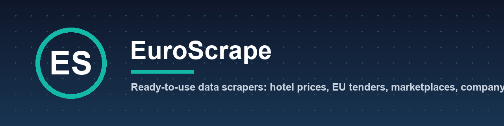

**Ready-to-use cloud scrapers on [Apify](https://apify.com/euroscrape).** No code, no servers: run them, schedule them, get alerts, pay only per result.

| | Actor | What you get |
|---|---|---|
| 🏨 | [Google Hotels Scraper](https://apify.com/euroscrape/google-hotels-prices) | Hotel prices on every booking site, rate parity, price calendars, price-drop alerts |
| 🏛️ | [EU Public Tenders Scraper](https://apify.com/euroscrape/eu-public-tenders) | Tenders and contract awards from all of Europe (TED) and France (BOAMP, DECP), winners per lot |
| ♻️ | [EU Second-Hand Marketplaces Scraper](https://apify.com/euroscrape/eu-marketplace-deals) | Vinted, OLX, Marktplaats, Kleinanzeigen… in 18 countries, prices in €, cheapest country |
| ⭐ | [App Store & Google Play Reviews Scraper](https://apify.com/euroscrape/app-reviews) | Reviews from both stores in 58 countries, rating by version, alerts on negative reviews |
| 🧩 | [Website Tech Stack Detector](https://apify.com/euroscrape/website-intelligence) | 280+ technologies, company identity, contacts and sales signals for any website |
| ⚖️ | [Impressum & Legal Notice Scraper](https://apify.com/euroscrape/company-identity) | Legal name, registry numbers and VAT IDs from any European website |
| 🇫🇷 | [French Companies Scraper](https://apify.com/euroscrape/france-companies) | Every French company from SIRENE, with finances, websites and emails |
| 🇬🇧 | [UK Companies House Scraper](https://apify.com/euroscrape/uk-companies) | UK companies by SIC code and location, with officers, websites and emails |
| 🇩🇪 | [Kleinanzeigen Scraper](https://apify.com/euroscrape/kleinanzeigen-scraper) | German classifieds with deal score, view counts and instant alerts |

📁 Input templates, real sample outputs and code snippets: [apify-actors](https://github.com/EuroScrape/apify-actors)
✍️ Tutorials: [dev.to/euroscrape](https://dev.to/euroscrape)
